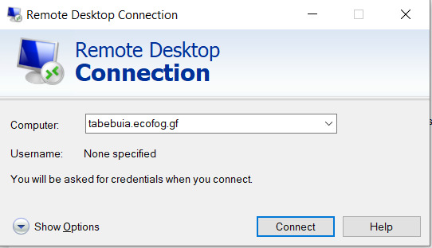
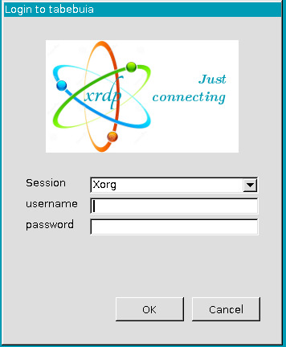
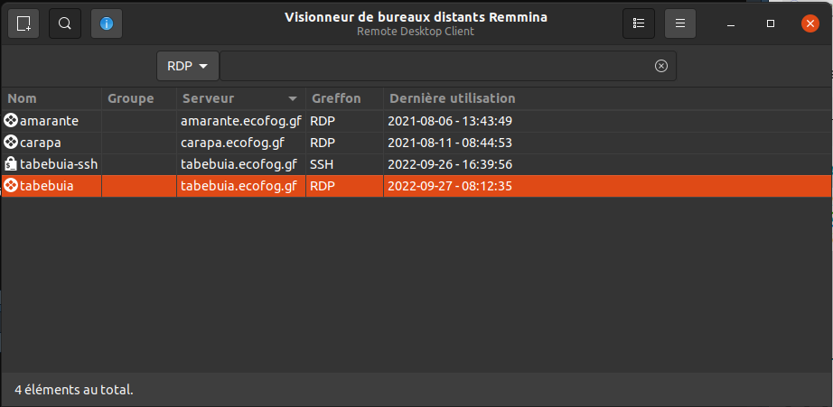
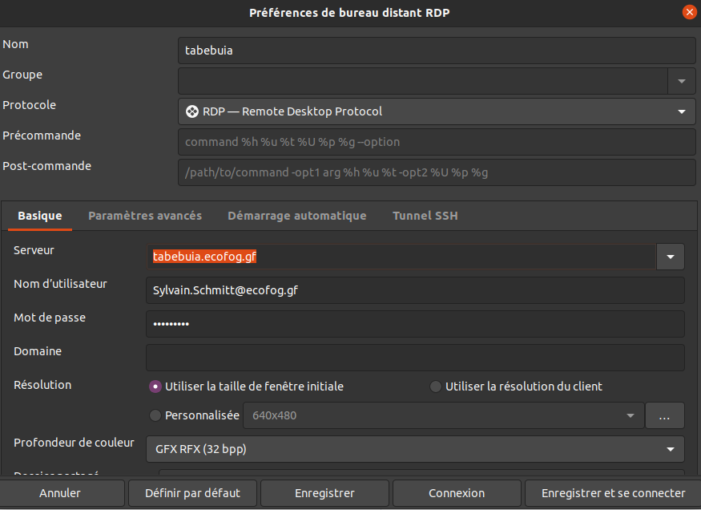
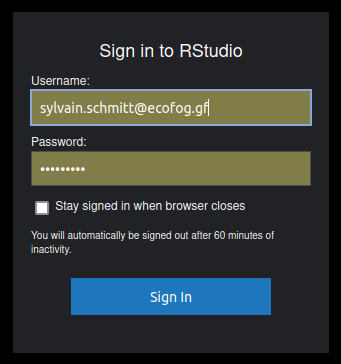
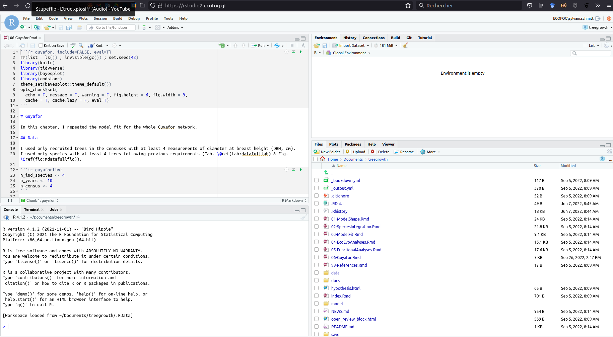
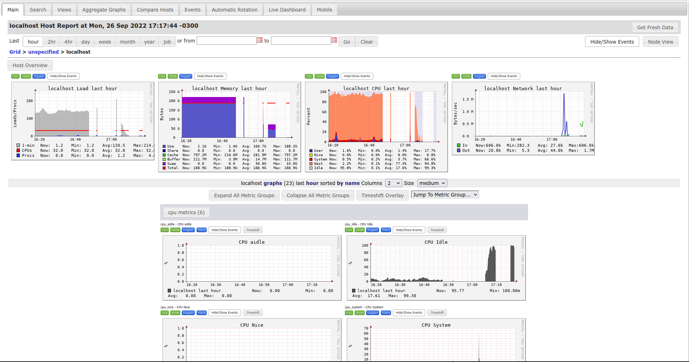
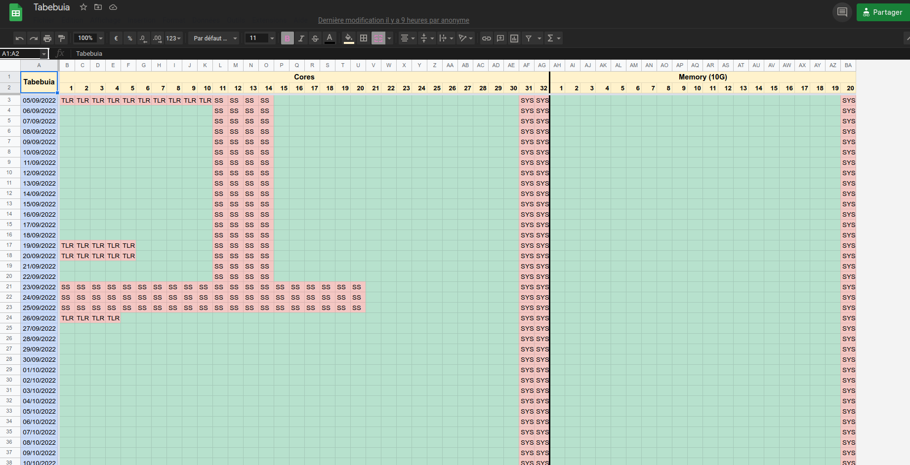
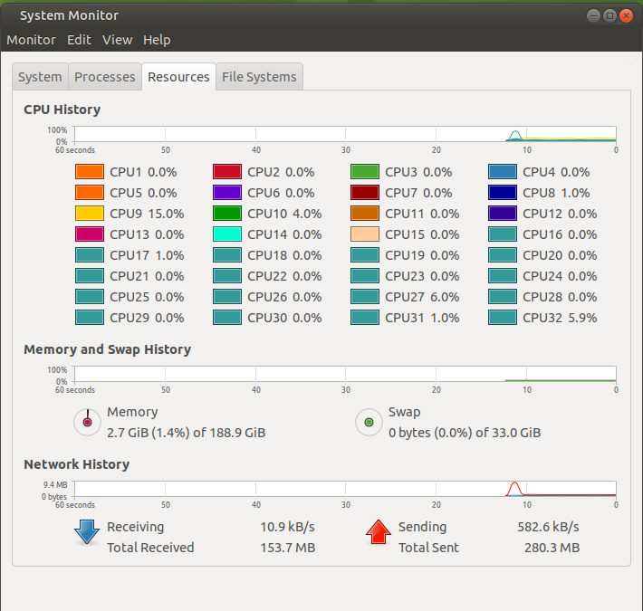
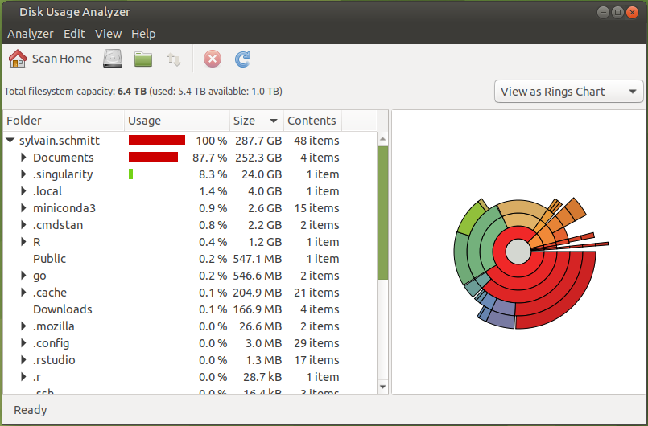

# (PART) Usage {-}

# Connection

## Remote Desktop 

The most common connection to Tabebuia is via the Remote Desktop Protocol (RDP) although other methods such as SSH tunneling can be used.

#### Windows

In windows use the "Remote Desktop Connection" tool with the address tabebuia.ecofog.gf:

```{r}

```

You will be connected to Tabebuia and have to enter your email and password in the XRDP security to connect to your session:

```{r}

```

### Linux

Under Linux you can use different tools, but I recommend Remmina which is quite common.
In the main window, you can create a profile for the Tabebuia RDP connection:

```{r}

```

you can directly enter your user name (email) and password to avoid connecting through XRDP:

```{r}

```

## Rstudio server

You may also only want to use R via the Rstudio server and not connect to a remote desktop. 
For that connect to the interface at: https://rstudio2.ecofog.gf/ .

```{r}

```

Use your email and password and you'll have access to an Rstudio interface within your browser:

```{r}

```

More information can be found at: https://support.rstudio.com/hc/en-us/articles/200552306-Getting-Started .

# Basic usage

Please follow these steps before starting a calculation on Tabebuia:

1. Check the cluster load at: http://tabebuia.ecofog.gf/ganglia
1. Indicate your scheduled usage for each day at: https://docs.google.com/spreadsheets/d/1b3uUrY0Wy9p4joah7N_JM49LVqHAxR3eUYSRHQZYxEU/edit?usp=sharing
1. Run and monitor your calculation

> If there is a shortage of resources, you can use the mailing list or contact connected users to ask them to specify their use or reduce their consumption.

## Ganglia

Ganglia is installed on Tabebuia and can be seen at: http://tabebuia.ecofog.gf/ganglia.
Ganglia is a system observer to check in time memory and CPU usage on the cluster:

```{r}

```

More information can be found at: http://ganglia.info/ .

## Google sheets

For now, the shared usage on Tabebuia is organised in a google doc where each user defines how many CPUs and memory (per 10GB) they need for how many days.
The google doc is available here :https://docs.google.com/spreadsheets/d/1b3uUrY0Wy9p4joah7N_JM49LVqHAxR3eUYSRHQZYxEU/edit?usp=sharing.
Just add your initial to book resources:

```{r}

```

> It is obvious that there is no control of the reserved use, so try to respect what you indicate.

## Mailing list

In case you need to contact all or certain users, a mailing list is maintained at: https://docs.google.com/document/d/191y_8Yc8j8a0mGkMUXOlo6ImyFjUyasCEeVGQ1kySlo/edit?usp=sharing.

# Cores

> Add a description of what are cluster cores, where to check their load, and how to estimate your need.

Use `MATE System Monitor` to monitor your CPU usage efficiently;

```{r}

```

More information can be found at: https://doc.ubuntu-fr.org/moniteur_systeme .

> Add a description of the top command here with links to documentation.

# Memory

> Add a description of what is RAM, where to check its load, and how to estimate your need.

Use `MATE System Monitor` to monitor your memory usage efficiently;

```{r}

```

More information can be found at: https://doc.ubuntu-fr.org/moniteur_systeme .

> Add a description of the top command here with links to documentation.

# Disk usage

The total disk space for all users is 5.41TB. 
So try to avoid using more than 200GB per user (for 25 users). 
If you need more temporarily, please ask on the mailing list.
**Tabebuia's disk space is not designed for long-term data storage.**
Try to clean up your data as soon as you do not need them anymore.
You can use a hard drive connected to Tabebuia or a direct link to Roucou to avoid storing raw data on Tabebuia.
You also need to ask short term staff to clean up their session before the end of their contract.

Use `MATE Disk usage Analyzer` to monitor your disk usage efficiently;

```{r}

```

More information can be found at: https://wiki.gnome.org/action/show/Apps/DiskUsageAnalyzer .
